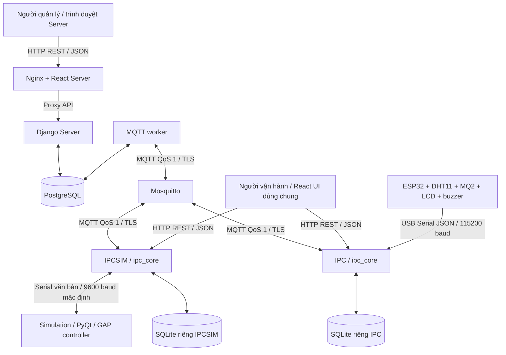
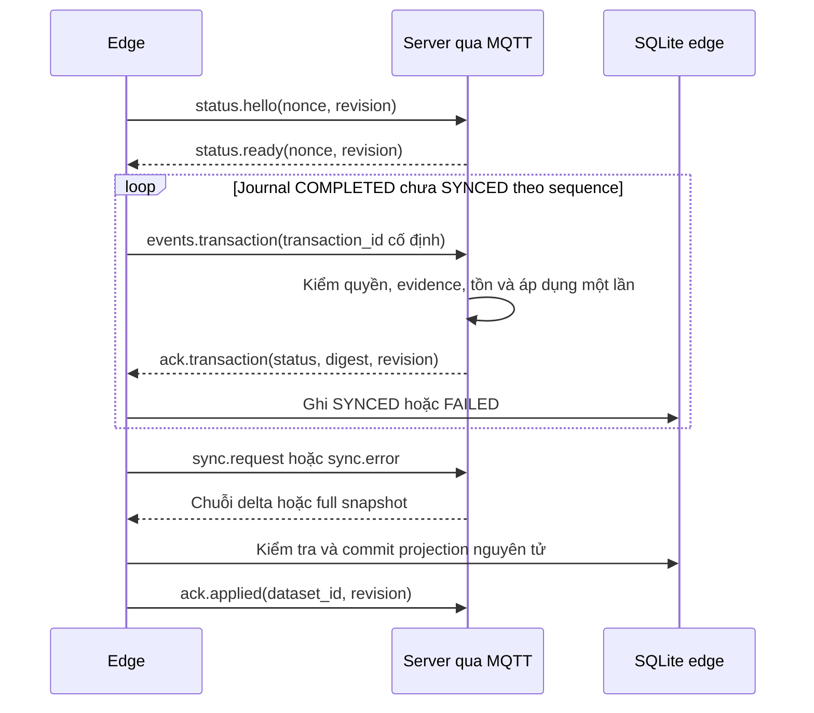

# Thiết kế chi tiết hệ thống Smart Inventory

**Mục đích:** tài liệu nền cho báo cáo thiết kế, triển khai và đánh giá hệ thống quản lý kho thông minh.  
**Mốc đối chiếu:** mã nguồn trong repository ngày 04/10/2026.  
**Phạm vi:** Server, IPC, IPCSIM, Simulation và firmware ESP32 hiện tại. Các ví dụ bản tin là ví dụ minh họa cấu trúc, không chứa thông tin đăng nhập thật.

## 1. Mục tiêu và nguyên tắc thiết kế

Hệ thống kết hợp quản lý tồn kho tập trung với giám sát và vận hành thiết bị tại điểm lưu trữ. Server quản lý sản phẩm, vị trí, người dùng, quyền truy cập và tồn kho chính thức. Edge IPC/IPCSIM duy trì dữ liệu cục bộ, nhận trạng thái thiết bị qua Serial, cung cấp giao diện vận hành và đồng bộ với Server qua MQTT.

Các nguyên tắc chính:

- IPC và IPCSIM sử dụng cùng `ipc_core`; khác biệt giao thức thiết bị được đóng gói trong adapter.
- Dữ liệu thiết bị thật và mô phỏng được phân biệt bằng danh tính thiết bị và miền dữ liệu, không cộng gộp tồn kho hai nguồn.
- Dữ liệu cấu hình và danh mục đi từ Server xuống edge; telemetry, sự kiện và giao dịch vật lý đi từ edge lên Server.
- Giao dịch cục bộ được ghi bền vững trước khi gửi lệnh ra thiết bị; dữ liệu truyền mạng được lưu trong outbox để gửi lại.
- Thành công ở tầng truyền thông không đồng nghĩa với hoàn thành chuyển động hoặc hoàn thành nghiệp vụ nhập/xuất.
- Đồng bộ master data không được ghi đè lên giao dịch vật lý đang thực hiện hoặc giao dịch hoàn tất chưa được Server chấp nhận.

## 2. Kiến trúc tổng thể



Server web và MQTT worker là hai tiến trình độc lập dùng chung PostgreSQL. Web xử lý yêu cầu người dùng; worker nhận uplink, lưu sự kiện, xử lý replay và gửi các bản tin trong outbox. Mosquitto định tuyến thông điệp, không thực hiện tính toán tồn kho.

IPC/IPCSIM chạy một ứng dụng FastAPI qua Uvicorn. Khi khởi động, ứng dụng kiểm tra danh tính, khởi tạo SQLite, phục hồi journal, chạy MQTT runtime và Serial listener. React UI dùng chung được phục vụ tại `/ui/` từ bản build `IPCSIM/frontend/dist`.

### 2.1. Thành phần và công nghệ

| Thành phần | Ngôn ngữ / công nghệ | Trách nhiệm |
|---|---|---|
| `Server/` | Python, Django, ORM | Master data, phân quyền, quản lý tồn kho, API, audit |
| `Server/inventory/mqtt.py` | Python, Paho MQTT | MQTT worker, xử lý uplink và outbox Server |
| `Server/frontend/` | JavaScript, JSX, React, Vite, CSS | Giao diện quản lý tập trung |
| `ipc_core/` | Python, FastAPI, Uvicorn, SQLAlchemy, sqlite3, Paho MQTT, pySerial | Nghiệp vụ edge, local API, đồng bộ, Serial |
| `IPC/main.py`, `IPCSIM/main.py` | Python | Launcher và nạp cấu hình từng instance |
| `IPCSIM/frontend/` | TypeScript, TSX, React, Axios, React Query | Giao diện vận hành chung cho hai loại edge |
| `Simulation/` | Python, PyQt, pySerial | GUI và mô phỏng chuyển động, cảm biến, lỗi |
| `esp32_master_serial/` | C++, Arduino framework, PlatformIO | Đọc cảm biến, LCD, buzzer, phát telemetry |
| PostgreSQL | SQL, PostgreSQL 16 trong Compose | Dữ liệu chính thức và journal Server |
| SQLite | SQL, WAL | Cache, snapshot và journal cục bộ edge |
| `deploy/` | YAML, Dockerfile, cấu hình Nginx/Mosquitto | Đóng gói và triển khai |

Firmware khai báo thư viện PubSubClient trong PlatformIO nhưng mã `main.cpp` hiện không sử dụng MQTT hoặc Wi-Fi. MQTT chạy giữa IPC/IPCSIM và Server, không chạy trực tiếp trên ESP32.

### 2.2. Ranh giới chức năng thực tế

| Chức năng | IPC + ESP32 hiện tại | IPCSIM + Simulation |
|---|---|---|
| Đồng bộ master data / giao diện edge | Có | Có |
| Nhiệt độ, độ ẩm | DHT11 thật | Dữ liệu tạo trong simulator |
| Khí / cảnh báo | ADC MQ2 và `gas_alert` | Trường smoke trong bản tin mô phỏng |
| Cân nặng | Firmware chưa gửi | Có trường mô phỏng |
| Chuyển động, khóa, endpoint, breakdown | Firmware chưa gửi | Có bản tin mô phỏng |
| OPEN/CLOSE/VENTILATE/LIGHT/HOME/LIGHT_OFF | Adapter chặn; firmware chưa có bộ nhận lệnh | Có |
| PUT/PICK dựa trên chuyển động | Chưa vận hành được với firmware hiện tại | Có khi thỏa điều kiện cục bộ |

`HARDWARE_ENABLED=true` cho phép IPC mở Serial nhận telemetry; cờ này không bổ sung khả năng điều khiển cho firmware. `HardwareAdapter.supports_commands=False` là giới hạn quyết định.

## 3. Mô hình dữ liệu và định danh vị trí

### 3.1. Cấu trúc lưu trữ

```text
Device → Cabinet → Rack → Shelf → Bin
                                  ↑
                       Item ← Stock(item, bin, quantity)
```

`Device` là điểm edge đã đăng ký. Cabinet thuộc một thiết bị và một miền; rack thuộc cabinet, shelf thuộc rack, bin thuộc shelf. Stock gắn sản phẩm với bin. Operation lưu yêu cầu thao tác, Ledger lưu biến động tồn, InventoryTransaction lưu lịch sử nghiệp vụ và AuditLog lưu hành động người dùng. RuntimeEvent và dữ liệu monitoring lưu thông tin nhận từ thiết bị.

### 3.2. Bốn loại định danh phải tách biệt

| Định danh | Ví dụ | Mục đích |
|---|---|---|
| Database PK/FK | `rack.id=13` | Quan hệ dữ liệu và tham chiếu API |
| Chỉ số cục bộ | `cabinet_index=2`, `rack_index=1` | Hiển thị Cabinet 02 / Rack 01 |
| Mã nghiệp vụ | `SIM-C02-R01` | Nhận diện vị trí có ý nghĩa |
| Địa chỉ Serial | `serial_address=7` | Định tuyến bản tin thiết bị |

Ví dụ trên chỉ minh họa: PK thực tế phụ thuộc database. Rack 01 của Cabinet 02 không phải Rack 13 dù PK bằng 13. Trường `rack_id` trên Serial là **địa chỉ Serial**, còn `rack_id` trong giao dịch nghiệp vụ thường là **PK**.

Server giữ địa chỉ trong `Rack.address`. Snapshot edge hiện dùng `data.rack_code` dạng chuỗi địa chỉ để tương thích; mã nghiệp vụ nằm trong `rack_identity_code`. Listener tra rack theo địa chỉ rồi thay bằng PK khi lưu snapshot SQLite. MQTT telemetry giữ địa chỉ gốc để Server ánh xạ trong phạm vi thiết bị gửi.

| Tầng | Thiết bị thật | Thiết bị mô phỏng |
|---|---|---|
| MQTT / runtime | `IPC` | `IPCSIM` |
| Inventory API / giao diện | `REAL` | `SIMULATION` |

Một địa chỉ có thể xuất hiện ở hai thiết bị khác nhau. Danh tính vị trí vì vậy phải bao gồm thiết bị và quan hệ parent, không chỉ số địa chỉ. Nhãn REAL trong database demo vẫn có thể là dữ liệu seed, không chứng minh hàng thật.

### 3.3. Topology mô phỏng

`Simulation/topology.py` hiện khai báo **22 group**, mỗi group **6 rack**, tổng **132 địa chỉ**. Group/cabinet hiển thị bắt đầu từ 1, còn `rack_group_id` nội bộ simulator bắt đầu từ 0.

```text
serial_address = (cabinet_index - 1) × 6 + rack_index
cabinet_index  = floor((serial_address - 1) / 6) + 1
rack_index     = ((serial_address - 1) mod 6) + 1
```

Ví dụ Cabinet 02 / Rack 01 có địa chỉ 7. Có thể cấu hình một `SERIAL_PORT`, hoặc nhiều `SERIAL_GROUP_PORTS` để mỗi group có đường Serial độc lập. Chế độ nhiều cổng chọn link theo công thức group và kiểm tra bản tin nhận có thuộc group của link đó.

**Lưu ý đối chiếu repository:** README và một số thông báo validation còn ghi 1–21, trong khi hằng số topology hiện là 22. Khi mô tả cấu trúc hiện tại dùng 22; khi triển khai cần kiểm tra đường cấu hình/UI thực tế, không coi các mô tả cũ là đặc tả chuẩn.

## 4. Các kênh giao tiếp

| Kết nối | Cơ chế / định dạng | Vai trò |
|---|---|---|
| Trình duyệt Server ↔ Nginx ↔ Django | HTTP REST, JSON | Quản lý, truy vấn, xác nhận, điều chỉnh tồn |
| React edge ↔ FastAPI | HTTP REST, JSON | Health, vị trí, inventory, đăng nhập và thao tác cục bộ |
| Server worker ↔ broker ↔ edge | MQTT, JSON envelope v1, QoS 1 | Đồng bộ, lệnh, ACK, telemetry, sự kiện, heartbeat |
| IPCSIM ↔ Simulation | Serial, UTF-8, dấu `|`, newline | Điều khiển và trạng thái mô phỏng |
| ESP32 → IPC | USB Serial, JSON một dòng, newline | Telemetry môi trường thật |
| ESP32 ↔ LCD | I²C | Hiển thị tại thiết bị |
| ESP32 ↔ DHT11/MQ2/buzzer | GPIO / ADC | Đọc cảm biến và cảnh báo cục bộ |

UI hiện cập nhật bằng HTTP polling: health edge khoảng 2 giây, trạng thái thao tác có thể 0,5 giây, một số dữ liệu môi trường/lịch sử khoảng 5 giây. Server có polling 5–10 giây tùy màn hình. Repository có hook `useWebSocket` nhưng không nên mô tả nó là kênh push đang hoạt động: ứng dụng FastAPI hiện không khai báo WebSocket endpoint trong `api.py`.

## 5. Giao thức Serial với Simulation

### 5.1. Đóng khung và truyền nhận

Bản tin là chuỗi UTF-8 kết thúc bằng `\n`; receiver loại bỏ khoảng trắng đầu/cuối nên chấp nhận dòng CRLF. Baudrate mặc định simulator và edge là **9600**, hai đầu phải cấu hình giống nhau. Các tham số pySerial mặc định tương ứng 8 bit dữ liệu, không parity, 1 stop bit.

SerialManager dùng khóa khi ghi để tránh xen kẽ các lệnh. Đọc có timeout 0,2 giây, giữ phần dòng chưa đủ newline; giới hạn bộ đệm 8192 byte. Ghi có timeout 1 giây và kiểm tra số byte ghi. Ghi đủ byte chỉ chứng minh đã đưa dữ liệu vào đường Serial. Listener thử kết nối lại sau lỗi với khoảng chờ 2 giây.

Simulator giữ một owner Serial cho mỗi `MasterCom`, dùng queue chuyển yêu cầu/sự kiện giữa các phần của ứng dụng. Bộ nhận lệnh simulator loại bỏ dòng lệnh quá 256 byte cho tới newline tiếp theo.

### 5.2. Bản tin lệnh

```text
0|<serial_address>|<action>\n
```

`0` là token đầu khung lệnh theo implementation hiện tại; không phải version MQTT hoặc PK thiết bị.

| Action | Tên miền nghiệp vụ | Ý nghĩa |
|---:|---|---|
| 0 | LIGHT | Bật đèn |
| 1 | OPEN | Tạo khe tiếp cận rack |
| 2 | CLOSE | Đóng khe tiếp cận |
| 3 | VENTILATE | Giãn các rack để thông gió |
| 4 | HOME | Trở về bố trí home của group |
| 5 | LIGHT_OFF | Tắt đèn |

Ví dụ `0|7|1` yêu cầu OPEN địa chỉ 7. Simulator chỉ chấp nhận khung đúng 3 trường, token đầu là `0`, địa chỉ thuộc group và action hợp lệ. HOME được quy về rack đầu group trong bộ xử lý simulator.

### 5.3. Bản tin trạng thái

| Loại | Cấu trúc theo thứ tự trường | Ánh xạ |
|---|---|---|
| ENVSTT | `ENVSTT|address|temperature|humidity|weight|smoke` | Telemetry môi trường |
| OPRSTT | `OPRSTT|address|movement_speed|displacement|is_hard_locked|is_endpoint|state` | Sự kiện vận hành |
| BRKSTT | `BRKSTT|address|is_obstructed|is_skewed|is_overload_motor` | Sự kiện sự cố |
| ACK | `ACK|...` | Parser nhận danh sách `values`; chưa phải biên nhận giao dịch đầy đủ |

Ví dụ:

```text
ENVSTT|7|28.5|65.0|80.0|0
OPRSTT|7|12.0|32.0|0|0|1
OPRSTT|7|0.0|64.0|0|1|-1
BRKSTT|7|0|0|0
```

Nhiệt độ có ý nghĩa °C, độ ẩm %. Trường weight là dữ liệu mô phỏng; giao thức không khai báo đơn vị trong khung. Không gán cho nó độ chính xác của cảm biến cân thật.

`state` thường gặp: `1` đang OPEN, `2` đang CLOSE, `3` đang VENTILATE, `0` LIGHT, `5` LIGHT_OFF, `-1` endpoint/idle sau lệnh, `-2` lỗi/từ chối. HOME phát trạng thái chuyển động tương đương CLOSE. Parser chấp nhận OPRSTT thiếu trường state và gán `None`, nhưng thiếu state không đủ làm bằng chứng hoàn thành PUT/PICK.

Simulator phát môi trường mỗi 10 giây, lặp snapshot breakdown theo chu kỳ này và cập nhật bộ điều khiển chuyển động mỗi 0,1 giây. OPRSTT được phát theo sự kiện tiến trình, không phải một snapshot bắt buộc của mọi rack mỗi 0,1 giây.

### 5.4. Mô hình chuyển động GAP

Mỗi group gồm 6 rack trên 7 vị trí logic, với một khe tiếp cận. Bộ điều khiển lập chuỗi bước di chuyển để đưa khe tới vị trí cần mở; các bước được thực hiện tuần tự. Queue lệnh theo FIFO và loại bỏ lệnh trùng liền kề; OPEN → CLOSE → OPEN vẫn là chuỗi hợp lệ.

Trong mô hình nội bộ, pitch và quãng bước là 100 mm, vận tốc mặc định 25 mm/s, các mức cấu hình là 20/25/33 mm/s. Thông gió phân bố khoảng giãn 20 mm giữa các rack. Controller kiểm tra phạm vi đường ray và thứ tự rack; lỗi chuyển động dừng bước, xóa queue và chuyển sang ERROR.

**Đơn vị ở biên Serial khác mô hình nội bộ:** `virtual_master_controller.py` chuyển một bước 100 mm sang độ dịch chuyển wire tối đa 64,0. Vì vậy `displacement=64.0` biểu diễn endpoint OPEN logic hiện tại, không được viết trong report là rack di chuyển 64 mm. Vận tốc wire cũng được nhân hệ số 64/100.

## 6. Giao thức ESP32 thật

### 6.1. Phần cứng và firmware

| Phần cứng | Chân / cấu hình | Vai trò |
|---|---|---|
| DHT11 | GPIO 4 | Nhiệt độ, độ ẩm |
| MQ2 | ADC GPIO 34 | Giá trị khí thô |
| Buzzer | GPIO 25 | Báo khí vượt ngưỡng |
| LCD 16×2 | I²C address `0x27`, SDA 21, SCL 22 | Hiển thị môi trường và cảnh báo |
| USB Serial | `Serial.begin(115200)` | Đường telemetry đang dùng |
| UART2 | RX16, TX17, 115200, 8N1 | Đã khởi tạo, nhưng lệnh phát bị comment |

Firmware cố định `RACK_ID=1`. Dữ liệu được gửi bằng `Serial.println(payload)`; `Serial2.println(payload)` chưa hoạt động. Không mô tả kết nối RX16/TX17 là đường truyền đang sử dụng.

### 6.2. Khung telemetry

```json
{"rack_id":1,"temperature":28.5,"humidity":65,"gas":2100,"gas_alert":true}
```

Khung kết thúc bằng newline. `gas` là ADC thô 0–4095, chưa quy đổi ppm. `gas_alert` là boolean theo điều kiện **`gas > 2000`**. Adapter giữ cờ này và thêm `smoke=1` khi true, `smoke=0` khi false để tương thích luồng cảnh báo hiện có; đây không phải phép đo khói riêng.

Chu kỳ gửi là 5 giây bình thường và 2 giây khi cảnh báo, được quyết định tại mỗi lần lấy mẫu. Firmware hiển thị LCD và phát buzzer cục bộ khi cảnh báo. Các thao tác delay trong loop khiến chu kỳ không phải cam kết thời gian thực cứng.

Nếu DHT trả NaN, firmware phát `DHT ERROR`, hiển thị lỗi và bỏ mẫu. Nhánh này return trước bước cập nhật buzzer và phát JSON, nên không thể khẳng định cảnh báo khí luôn được xử lý đầy đủ khi DHT lỗi. `START SYSTEM` và `DHT ERROR` là dòng chẩn đoán, không được lưu như mẫu môi trường.

HardwareAdapter kiểm tra địa chỉ nguyên dương, giá trị số hữu hạn, miền ADC và kiểu boolean của `gas_alert`. Firmware không gửi timestamp, sequence, checksum, command ID hoặc ACK. Timestamp MQTT vì vậy là thời gian edge tạo envelope, không phải thời gian lấy mẫu có xác thực trên ESP32.

## 7. Giao thức MQTT v1

### 7.1. Topic và phân quyền định tuyến

```text
inventory/v1/<device_id>/<direction>/<channel>
```

- `direction=up`: edge → Server; `direction=down`: Server → edge.
- Channel hợp lệ: `sync`, `command`, `ack`, `telemetry`, `events`, `status`.
- `device_id` gồm 1–64 ký tự chữ, số, `_` hoặc `-`.
- Edge subscribe `inventory/v1/<device_id>/down/+`; Server subscribe `inventory/v1/+/up/+`.

Ví dụ `inventory/v1/IPCSIM01/up/telemetry`. MQTT username của edge bằng device ID. ACL cho mỗi edge chỉ publish nhánh up và đọc nhánh down của chính mình. Tài khoản worker `inventory-server` có quyền đọc uplink và ghi downlink toàn hệ thống.

### 7.2. Envelope chung

```json
{
  "protocol_version": 1,
  "message_id": "11111111-1111-4111-8111-111111111111",
  "device_id": "IPC01",
  "device_type": "IPC",
  "message_type": "telemetry.sample",
  "timestamp": "2026-10-04T03:00:00+00:00",
  "payload": {
    "rack_id": 1,
    "temperature": 28.5,
    "humidity": 65,
    "gas": 2100,
    "gas_alert": true,
    "smoke": 1
  }
}
```

| Trường | Quy tắc |
|---|---|
| `protocol_version` | Hiện chỉ chấp nhận 1 |
| `message_id` | Generator thường tạo UUID; replay giao dịch dùng transaction ID cố định |
| `device_id`, `device_type` | Phải khớp registry/cấu hình và topic |
| `message_type` | Tiền tố trước dấu chấm phải khớp channel |
| `timestamp` | ISO 8601 có timezone; generator dùng UTC |
| `payload` | JSON object |
| `correlation_id` | Liên kết ACK với bản tin/giao dịch gốc khi cần |
| `dataset_id`, `revision` | Metadata đồng bộ dữ liệu |
| `sync_id` | Nhóm các batch của cùng full snapshot |
| `command_id` | Định danh operation/lệnh để chống thực thi lặp |

Metadata bổ sung phụ thuộc loại bản tin, không phải tất cả đều bắt buộc cho telemetry. Validator chung yêu cầu `message_id` có giá trị nhưng không kiểm tra mọi ID đều đúng cú pháp UUID; replay giao dịch có kiểm tra UUID riêng.

JSON được canonical hóa bằng cách sắp xếp key, bỏ khoảng trắng không cần thiết, giữ Unicode và không cho NaN. Digest đồng bộ là SHA-256 của JSON canonical. Digest kiểm tra nội dung, không thay thế xác thực người gửi bằng TLS và ACL. Decoder giới hạn kích thước 2.000.000 byte và có hỗ trợ tháo wrapper `message/signature` của phiên bản cũ; không nên mô tả envelope hiện tại có chữ ký mật mã trên mọi bản tin.

### 7.3. Danh mục bản tin

| Message type | Hướng | Ý nghĩa |
|---|---|---|
| `status.hello` / `status.ready` | up / down | Handshake với nonce |
| `status.heartbeat` / `status.lease` | up / down | Liveness edge và lease Server |
| `status.reconciled` | down | Server xác nhận revision đang bằng nhau |
| `sync.request` / `sync.error` | up | Xin đồng bộ thường / yêu cầu full để sửa sai lệch |
| `sync.full` / `sync.delta` | down | Full snapshot / thay đổi nối tiếp |
| `ack.applied` | up | Edge xác nhận dataset đã áp dụng |
| `telemetry.sample` | up | Mẫu môi trường |
| `events.serial` | up | Trạng thái vận hành, breakdown, ACK Serial đã chuẩn hóa |
| `events.transaction` | up | Replay giao dịch vật lý hoàn tất |
| `ack.transaction` | down | Kết quả APPLIED hoặc CONFLICT kèm digest/revision |
| `ack.received` / `ack.rejected` | down | Biên nhận hoặc từ chối xử lý uplink |
| `command.execute` | down | Yêu cầu lệnh theo operation/revision |
| `events.command_result` | up | Báo sent, uncertain, expired hoặc trạng thái đã ghi nhận |
| `command.finalize` / `ack.command` | down / up | Chốt trạng thái nghiệp vụ và xác nhận đã nhận |

### 7.4. Độ tin cậy truyền thông

MQTT sử dụng QoS 1, `clean_session=False`, manual ACK, keepalive 20 giây và reconnect delay 1–30 giây. QoS 1 cho phép giao lặp; hệ thống xử lý bằng Receipt, message ID, transaction ID và command ID cùng journal bền vững. Đây là truyền **ít nhất một lần**, kết hợp chống áp dụng nghiệp vụ lặp; không phải bảo đảm thực thi vật lý exactly-once.

PUBACK chỉ xác nhận giao ở tầng MQTT. Outbox nghiệp vụ thường chờ ACK ứng dụng trước khi xóa/đánh dấu hoàn tất. Khi xử lý lỗi tạm thời như database mất kết nối, worker giữ khả năng nhận lại bản tin; lỗi dữ liệu hợp lệ về danh tính có thể nhận `ack.rejected`.

Broker có persistence, TLS trên cổng 8883, không anonymous và tắt retained message. Edge cũng từ chối retained command. Không dùng retained message để lưu lệnh điều khiển cần thực thi.

## 8. Đồng bộ dữ liệu Server → edge

### 8.1. Dataset và revision

Mỗi device có dataset riêng với revision tăng khi snapshot master thay đổi. Dataset gồm cấu hình device, danh mục item, auth được phân quyền, cabinet/rack/shelf/bin thuộc thiết bị và stock tương ứng. Record có cấu trúc `key`, `kind`, `data`, và `domain` khi cần; ví dụ `key="rack:13"`.

Server giữ snapshot hiện tại và Outbox. Edge giữ `edge_records`, `edge_revision`, `edge_staging` và các bảng nghiệp vụ được projection tạo/cập nhật. Master cache có thể thay thế; `local_transactions` là journal riêng phải được bảo toàn.

### 8.2. Full snapshot

Server chia records thành batch tối đa 200 record. Các batch dùng chung `sync_id`, revision và digest toàn snapshot:

```text
metadata: dataset_id, revision, sync_id
payload:  index, count, digest, records
```

Edge lưu từng batch vào staging, kiểm tra index/count, metadata thống nhất và nội dung batch lặp. Khi nhận đủ batch, edge ghép theo index, kiểm SHA-256 toàn bộ, kiểm miền dữ liệu rồi cập nhật cache, projection, revision và enqueue ACK trong cùng SQLite transaction. UI không được nhìn thấy dataset mới chỉ áp dụng một phần.

Full snapshot có thể sửa read model bị hỏng ở cùng revision. Đường runtime cho phép reset revision bằng full snapshot theo các điều kiện trong Store, đồng thời không chấp nhận revision thấp hơn mốc giao dịch cục bộ đã được Server ACK.

### 8.3. Delta

```text
metadata: dataset_id, revision
payload:  base_revision, records, deleted, digest
```

Điều kiện bắt buộc: `base_revision == current_revision` và `revision == current_revision + 1`. Digest tính trên object chứa `records` và `deleted`. Nếu đứt chuỗi revision, checksum sai hoặc projection không hợp lệ, runtime yêu cầu full sync thay vì áp dụng tùy ý.

### 8.4. Trình tự reconnect



Edge chỉ nhận master khi handshake ready, không còn giao dịch active và không còn giao dịch COMPLETED chưa SYNCED. Nếu replay xung đột, journal được giữ để đối soát; việc pull master tiếp tục bị chặn để tránh xóa dấu vết tồn cục bộ đã thay đổi.

Handshake retry tối thiểu 5 giây và được làm mới khoảng 60 giây. Khi đủ điều kiện, sync request lặp sau khoảng 15 giây. Server ưu tiên chuỗi delta còn liên tục trong outbox, nếu thiếu chuỗi thì tạo full snapshot.

## 9. Nghiệp vụ PUT/PICK và đồng bộ offline

### 9.1. Điều kiện bắt đầu

Người vận hành đăng nhập tại edge bằng dữ liệu auth đã đồng bộ. Hệ thống kiểm quyền `inventory.move`, master đã được đồng bộ lần đầu, sản phẩm/vị trí thuộc phạm vi thiết bị, số lượng nguyên dương, tồn và capacity phù hợp. Không bắt đầu giao dịch mới nếu có giao dịch vật lý đang active hoặc lệnh Server chưa được giải quyết. Serial phải kết nối và adapter phải hỗ trợ lệnh để thao tác thành công.

Offline ở đây nghĩa là mất lease Server/MQTT nhưng vẫn có cache, quyền cục bộ và đường thiết bị hoạt động. Không có master/auth ban đầu thì không thể vận hành offline. Với ESP32 hiện tại, giới hạn adapter telemetry-only vẫn ngăn thực hiện PUT/PICK dù cache đã sẵn sàng.

### 9.2. Máy trạng thái cục bộ

```text
PREPARED
   → EXECUTING (OPEN)
   → AWAITING_CONFIRMATION
   → PREPARED → EXECUTING (CLOSE)
   → COMPLETED + sync_status=PENDING

Lỗi truyền không rõ kết quả / restart khi đang làm → UNCERTAIN
Breakdown trong lúc thực hiện                     → FAILED
Người vận hành xác nhận không thành công          → CANCELLED
```

Lệnh OPEN/CLOSE không có transaction ID trên wire legacy. Để tránh nhầm snapshot idle ban đầu là hoàn thành, service yêu cầu thấy trạng thái đang di chuyển của đúng địa chỉ trước, rồi mới chấp nhận `state=-1`, `is_endpoint=1` và displacement phù hợp: OPEN > 0, CLOSE = 0.

Sau OPEN, người vận hành xác nhận kết quả thực tế và ghi note. Bình thường hệ thống gửi CLOSE, chờ endpoint rồi cập nhật tồn cục bộ và journal trong cùng transaction. Chế độ `keep_open=true` được hỗ trợ khi xác nhận thành công với bằng chứng endpoint OPEN; giao dịch hoàn tất nhưng rack được giữ mở. Lần sau có thể tái sử dụng trạng thái mở đã ghi nhận.

`request_key` ổn định giúp retry API không tạo giao dịch mới. Reuse key với nội dung khác bị từ chối. Runtime dùng khóa và các kiểm tra journal để ngăn nhiều thao tác tranh quyền điều khiển.

### 9.3. Nội dung replay giao dịch

Payload `events.transaction` gồm:

```text
transaction_id, ipc_id, operation_type,
product_id, cabinet_id, rack_id, location_id,
quantity, user_id, authorization,
created_at, completed_at, evidence, note
```

Các ID vị trí ở payload này là database ID. `evidence` hiện là chuỗi JSON chứa trạng thái endpoint và các cờ thực tế; `authorization` là grant được Server ký, không phải MQTT password. Journal có `sequence` cục bộ để quyết định thứ tự replay nhưng sequence không nằm trong danh sách trường payload hiện tại.

Server kiểm transaction ID, digest, device scope, signed grant, số lượng, timezone/thứ tự thời gian, cây vị trí và bằng chứng CLOSE hoặc giữ OPEN hợp lệ. Server khóa dữ liệu tồn, kiểm không âm/không vượt capacity, ghi Stock, Operation, Ledger, InventoryTransaction, AuditLog và revision trong transaction.

Nếu transaction đã APPLIED với cùng device và digest, Server trả kết quả cũ mà không cộng/trừ tồn lần nữa. Cùng transaction ID nhưng nội dung khác bị coi là collision. Nếu xung đột tồn hoặc bằng chứng không hợp lệ, Server lưu CONFLICT; edge lưu FAILED và lỗi. Bản ghi hoàn tất chưa SYNCED vẫn có thể được retry theo thứ tự, nhưng không được tự đổi ID hoặc quantity để né xung đột.

Edge chỉ ghi SYNCED khi ACK có digest khớp payload bền vững và trạng thái APPLIED với revision hợp lệ. Retry giao dịch tăng khoảng chờ theo `2^retry_count` với số mũ giới hạn 5, tức tối đa khoảng 32 giây trong công thức hiện tại, cộng độ trễ vòng pump.

### 9.4. Phục hồi sau crash

Khi edge khởi động lại, PREPARED/EXECUTING/AWAITING_CONFIRMATION chuyển sang UNCERTAIN; SYNCING chuyển về PENDING. Hệ thống không tự phát lại lệnh vật lý chưa rõ kết quả. Người vận hành phải kiểm tra và đối soát tình trạng thiết bị.

Ghi journal trước side effect giúp biết có ý định thao tác, nhưng không loại bỏ khoảng thời gian giữa ghi database và chuyển động thiết bị. Do Serial legacy thiếu ID/counter, khả năng phân biệt bản tin trễ hoặc lặp còn hạn chế; yêu cầu moving → endpoint là biện pháp tương quan bảo thủ.

## 10. Lệnh từ Server và điều chỉnh tồn

Runtime vẫn có đường `command.execute` để xử lý operation từ Server. Edge kiểm lease online, revision lệnh bằng revision cache, địa chỉ thuộc dataset, thời hạn và command ID. Intent được ghi thành uncertain trước Serial; sau ghi thành công chuyển sent. Command ID đã tồn tại được trả trạng thái cũ, không phát lệnh lặp. ID trùng với payload khác bị từ chối.

Operation Server được tạo với thời hạn khoảng 30 giây. `events.command_result=sent` chỉ phản ánh gửi Serial. Theo dõi execution dựa trên telemetry/sự kiện là lớp riêng; xác nhận nghiệp vụ chính thức thực hiện qua service Server và tạo ledger khi phù hợp. `command.finalize` thông báo kết quả cuối cùng cho edge, sau đó edge trả `ack.command`.

Luồng vận hành UI hiện tập trung vào local operator API ở IPC/IPCSIM; sự tồn tại của protocol lệnh Server không có nghĩa Server UI đang là nơi điều khiển mọi thao tác cabinet. Điều chỉnh tồn tập trung là nghiệp vụ riêng: ghi người thực hiện, lý do, before/after và kiểm số lượng hiện tại/capacity. Không dùng CRUD trực tiếp `Stock.quantity` thay cho giao dịch điều chỉnh có audit.

## 11. Lưu trữ, đồng thời và tính nhất quán

| Cơ chế | Ý nghĩa |
|---|---|
| PostgreSQL transaction và `select_for_update` | Bảo vệ tồn kho, operation và revision khi xử lý đồng thời |
| Thứ tự khóa devices → operation → stock | Giảm tranh chấp giữa operation, xác nhận và assignment |
| SQLite `BEGIN IMMEDIATE` | Tuần tự hóa các ghi cục bộ |
| SQLite WAL, `synchronous=FULL`, FK enabled | Journal bền vững và quan hệ dữ liệu được kiểm tra |
| DB identity theo device ID/type | Ngăn một SQLite dùng nhầm cho thiết bị khác |
| Outbox cùng transaction với thay đổi nghiệp vụ | Không mất yêu cầu gửi khi tiến trình dừng sau commit |
| Receipt / transaction digest / command journal | Phân biệt bản tin lặp với yêu cầu mới |
| Staging + checksum + atomic projection | Không áp dụng snapshot thiếu batch hoặc sai nội dung |

Server là nguồn master và tồn chính thức, nhưng edge có thể tạm khác Server sau giao dịch offline. Hai phía hội tụ sau replay được chấp nhận và reconcile; không có distributed transaction đồng thời qua Serial, MQTT và hai database.

Telemetry/event uplink được lưu trong outbox khi địa chỉ thuộc assignment. Outbox edge retry bản tin đã gửi nhưng chưa nhận biên nhận sau khoảng 15 giây; Server retry durable downlink sau khoảng 5 giây. Heartbeat cũ được gộp để chỉ giữ mẫu mới nhất, còn sự kiện nghiệp vụ được giữ riêng. Sự kiện gửi lại nhiều có thể tạo backlog; đây không phải hệ thống hard real-time.

## 12. Trạng thái kết nối và bảo mật

### 12.1. Ba trạng thái độc lập

- **Broker connected:** edge đã kết nối MQTT; chưa chứng minh worker Server hoạt động.
- **Server online:** edge đang có lease hợp lệ do Server trả về.
- **Serial connected:** cổng thiết bị mở; chưa chứng minh endpoint/chuyển động thành công.

Heartbeat được tạo khoảng 10 giây khi MQTT kết nối. Server chỉ chấp nhận heartbeat có tuổi từ -10 đến 45 giây, trả lease 35 giây. Edge giới hạn lease nhận không vượt 35 giây kể từ hiện tại. Dashboard Server coi device offline nếu quá 45 giây không nhận heartbeat hợp lệ.

`server_synced` ở edge yêu cầu Server online, remote revision > 0, revision local bằng remote và không còn giao dịch pending. `acknowledged_revision` tại Server phản ánh dataset edge đã ACK, không phải biên nhận riêng cho mọi telemetry/giao dịch.

### 12.2. Xác thực và phân quyền

MQTT dùng TLS CA, username/password và ACL theo thiết bị. HTTP API edge yêu cầu `Authorization: Bearer <EDGE_API_TOKEN>`; trang `/ui/` được phục vụ để trình duyệt tải ứng dụng. API thao tác cục bộ yêu cầu thêm `X-Operator-Session` và kiểm quyền người dùng từ snapshot.

Phiên operator cục bộ tồn tại trong RAM, thời hạn 8 giờ và bị mất khi restart. Phiên được kiểm version credential/permission; khi auth snapshot đổi, phiên cũ có thể bị vô hiệu. Edge lưu password hash và grant có chữ ký để đăng nhập/ủy quyền offline, không gửi các trường nhạy cảm này qua API public snapshot hoặc danh sách transaction.

Khi offline, thay đổi/thu hồi quyền mới ở Server chưa thể đến edge cho tới lần đồng bộ tiếp theo. Đây là giới hạn của quyền cache; không nên khẳng định thu hồi quyền có hiệu lực tức thì tại mọi edge mất mạng.

API đọc cache cũ được giữ để tương thích, nhưng các ghi ngoài `/api/operator/` bị middleware chặn. Server dùng session và kiểm quyền theo nguồn REAL/SIMULATION, đồng thời ghi audit. Không đưa mật khẩu, API token hay signed grant thật vào báo cáo.

## 13. Triển khai và cấu hình

Docker Compose triển khai PostgreSQL 16, Mosquitto 2, tiến trình migrate, Django server, MQTT worker và Nginx web. PostgreSQL, MQTT persistence và static files có volume riêng. Nginx phục vụ React, proxy `/api/` và `/admin/` tới Django cổng nội bộ 8001.

| Điểm truy cập mặc định trong tài liệu chạy | Địa chỉ / cổng |
|---|---|
| Server web | `http://localhost:8080` |
| MQTT TLS | 8883 |
| IPCSIM UI | `http://127.0.0.1:8000/ui/` |
| IPC UI trong cấu hình hướng dẫn | `http://127.0.0.1:8002/ui/` |

Các cổng là cấu hình, không cố định trong protocol. Compose bind localhost mặc định; triển khai LAN phụ thuộc cấu hình bind, hostname và chứng chỉ. HTTP trong cấu hình local hiện tại không tự trở thành HTTPS vì MQTT có TLS.

Các nhóm biến cấu hình cần mô tả trong report:

| Nhóm | Biến chính |
|---|---|
| Danh tính / database | `DEVICE_ID`, `DEVICE_TYPE`, `DB_PATH` |
| Serial | `SERIAL_PORT` hoặc `SERIAL_GROUP_PORTS`, `SERIAL_BAUDRATE` |
| MQTT | `MQTT_HOST`, `MQTT_PORT`, `MQTT_PASSWORD`, `MQTT_TLS`, `MQTT_CA` |
| API edge | `EDGE_API_HOST`, `EDGE_API_PORT`, `EDGE_API_TOKEN` |
| Phần cứng | `HARDWARE_ENABLED` |

Mỗi instance cần device ID, database và cổng Serial riêng. Không chạy hai MQTT client cùng device ID vì có thể bị session takeover. Một cổng COM không được đồng thời mở bởi IPC và Serial Monitor. Simulation và IPCSIM cần hai đầu đường Serial tương ứng; chọn Start ở Simulation để bắt đầu hoạt động group.

Hướng dẫn thực hành: [cài đặt lần đầu](first-time-setup.md), [khởi chạy](startup.md), [IPC–ESP32](ipc-esp32.md), [sử dụng Inventory Server](server-inventory.md).

## 14. Kịch bản lỗi và xử lý

| Tình huống | Hành vi hiện tại / hệ quả |
|---|---|
| Mất MQTT | Lease hết hạn, journal và outbox giữ local; reconnect handshake và replay trước pull |
| Broker hoạt động nhưng worker dừng | Có thể broker connected nhưng Server offline do không có lease mới |
| Mất Serial | Listener reconnect; ghi lệnh không rõ kết quả cần kiểm tra thiết bị |
| Crash khi thao tác | Journal active chuyển UNCERTAIN, không tự chạy lại lệnh |
| Bản tin MQTT lặp | Chống xử lý lặp bằng Receipt hoặc journal ID/digest |
| Snapshot thiếu batch | Staging giữ lại, chưa thay read model |
| Delta đứt revision / digest sai | Xin full sync |
| Địa chỉ chưa assigned | Bỏ snapshot nghiệp vụ; không đưa telemetry ngoài assignment lên Server |
| Vật cản / lệch / quá tải motor | Chặn OPEN/CLOSE/VENTILATE theo snapshot breakdown; lỗi active có thể làm transaction FAILED |
| Replay vượt tồn/capacity | Lưu CONFLICT/FAILED và đối soát, không áp dụng một phần |
| DHT lỗi | Không có mẫu mới; không tạo số liệu thay thế |
| Lệnh đến quá hạn | Ghi expired, không phát Serial |

Không có checksum/sequence trên Serial hiện tại, không có xác nhận lấy mẫu từ MCU và không có transaction ID trên khung simulator legacy. Các đảm bảo journal và MQTT giúp bảo vệ nghiệp vụ ở tầng ứng dụng, nhưng không biến đường Serial này thành giao thức điều khiển có xác nhận end-to-end đầy đủ.

## 15. Kiểm chứng và tài liệu nguồn

Tài liệu này được đối chiếu mã nguồn; việc tạo tài liệu không đồng nghĩa đã chạy lại toàn bộ hệ thống hoặc kiểm định phần cứng. Khi viết phần kết quả thực nghiệm, chỉ ghi số liệu từ log/test đã thực hiện trong phiên đo tương ứng.

| Nội dung cần kiểm chứng | Nguồn trong repository |
|---|---|
| Envelope, topic, canonical JSON | [`ipc_core/protocol.py`](../ipc_core/protocol.py) |
| Runtime, lease, outbox, command | [`ipc_core/runtime.py`](../ipc_core/runtime.py), [`ipc_core/store.py`](../ipc_core/store.py) |
| Reconnect và barrier replay | [`ipc_core/sync_service.py`](../ipc_core/sync_service.py), [`ipc_core/local_repository.py`](../ipc_core/local_repository.py) |
| PUT/PICK và bằng chứng endpoint | [`ipc_core/transaction_service.py`](../ipc_core/transaction_service.py) |
| Adapter và khung Serial | [`ipc_core/adapters.py`](../ipc_core/adapters.py), [`parser.py`](../ipc_core/app/serial/protocol/parser.py), [`serial_manager.py`](../ipc_core/app/serial/serial_manager.py) |
| Server sync và xử lý MQTT | [`services.py`](../Server/inventory/services.py), [`mqtt.py`](../Server/inventory/mqtt.py) |
| Replay và signed grant | [`Server/inventory/offline.py`](../Server/inventory/offline.py) |
| Local API và đăng nhập | [`api.py`](../ipc_core/api.py), [`operator_api.py`](../ipc_core/operator_api.py), [`auth_service.py`](../ipc_core/auth_service.py) |
| Topology / chuyển động / wire unit | [`topology.py`](../Simulation/topology.py), [`gap_controller.py`](../Simulation/gap_controller.py), [`virtual_master_controller.py`](../Simulation/virtual_serial/virtual_master_controller.py) |
| Firmware và chân phần cứng | [`esp32_master_serial/src/main.cpp`](../esp32_master_serial/src/main.cpp) |
| Deployment / TLS / ACL | [`compose.yaml`](../deploy/compose.yaml), [`mosquitto.conf`](../deploy/mosquitto.conf), [`acl`](../deploy/acl) |

Các nhóm test phù hợp để trích dẫn phương pháp kiểm thử gồm `tests/test_esp32_adapter.py`, `test_serial_transport.py`, `test_serial_location.py`, `test_projection.py`, `test_edge.py`, `test_gap_controller.py`, `test_crash.py` và các test Server về MQTT, offline, concurrency, location. Test mô phỏng không thay thế thử nghiệm actuator/cảm biến thật.

## 16. Hướng phát triển đề xuất

Các mục sau là đề xuất, chưa phải chức năng đã triển khai trong firmware hiện tại:

1. Bổ sung receiver lệnh ESP32 với command ID, ACK chấp nhận, trạng thái tiến trình và kết quả endpoint.
2. Chuẩn hóa Serial có version, sequence, checksum, đơn vị đo và mã lỗi rõ ràng; phân biệt restart của MCU với reconnect cổng.
3. Bổ sung cảm biến endpoint, trạng thái motor, tải và interlock phần cứng trước khi mở vận hành REAL.
4. Hiệu chuẩn MQ2 nếu cần báo ppm; giữ rõ nguồn ADC và điều kiện đo thay vì chỉ đổi nhãn hiển thị.
5. Thống nhất mô tả 22 group và đơn vị mô phỏng trên toàn bộ tài liệu/UI/test.
6. Bổ sung chính sách thời hạn quyền offline, retention dữ liệu telemetry/outbox và theo dõi backlog khi triển khai lâu dài.

Khi dùng tài liệu này trong report, các chương kiến trúc, truyền thông, đồng bộ và phục hồi có thể lấy từ mục 2–12; mục 14 dùng cho phân tích độ tin cậy, mục 15 cho phương pháp kiểm chứng và mục 16 cho hướng phát triển.
